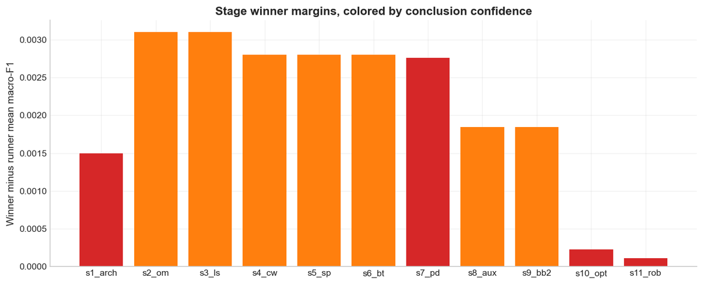
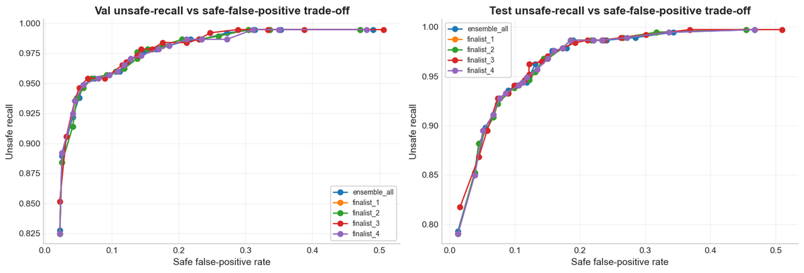
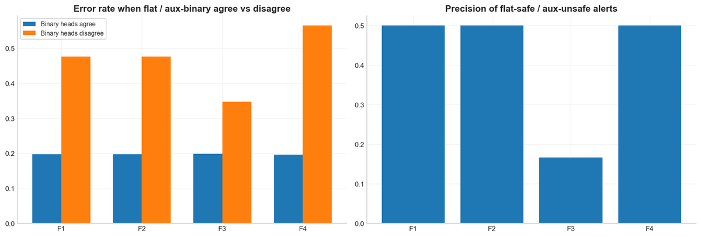
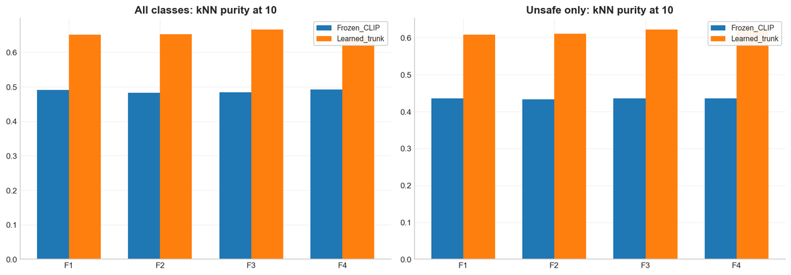

# Multimodal Safety Classification with CLIP

Frozen OpenCLIP encoders with a learned fusion head that classify an image–text pair as **Safe** or one of **8 unsafe classes**.

This is the CLIP track of a 4-person NUS DSA4266 group project (January–April 2026), which I designed and ran. Teammates Liu Qianru, Xu Yunhe and Yan Shuhe built the comparison models (ImageBind with LoRA and a MobileNetV2 + BiGRU baseline); that work is not in this repository.

Despite the repository name, the task is multimodal safety classification. Jailbreak prompts are one of the 15 source categories in the benchmark, not the whole task.

## Results

Test set: 684 image–text pairs from a stratified 70/15/15 split of 4,555 pairs (46% Safe). All four finalists share the recipe below and differ only in the listed settings. Figures are means over three final-fit seeds (45–47), taken from the analysis export in [`analysis/`](analysis/).

| Finalist | Differs by | Test macro-F1 | Unsafe-only macro-F1 | Unsafe items predicted Safe |
|---|---|---|---|---|
| F1 | lr 1e-3, weight decay 1e-4, auxiliary weights (0.25, 0) | 0.712 | 0.723 | 5.8% |
| F2 | weight decay 5e-4 | 0.712 | 0.723 | 5.8% |
| F3 | lr 5e-4 | 0.708 | 0.723 | 4.5% |
| F4 | auxiliary weights (0.5, 0.25) | 0.714 | 0.726 | 5.4% |

**Shared recipe:** ViT-L-14 (`laion2b_s32b_b82k`), interaction fusion, linear head, flat 9-way output with auxiliary Safe/Unsafe and unsafe-subclass heads, projection dimension 256, cross-entropy with effective-number class weighting (β = 0.999), shuffled batches.

**Calibration:** temperature scaling fitted on validation logits cut expected calibration error for the four-model ensemble from 0.046 to 0.031, with macro-F1 unchanged at 0.706.

The course report quotes slightly different figures for the same finalists (for example, 0.711 macro-F1 for its best model) because it used a separate evaluation pass. Both round to 0.71. In the report, the team's ImageBind LoRA model reached a higher macro-F1 (0.744) but needed a much larger calibration correction.

## How the recipe was chosen

A staged beam search with 5-fold cross-validation ran 2,925 runs across 11 stages. Each stage changed one part of the recipe and kept the best candidates for the next:

1. Architecture: ViT-B-16 or ViT-L-14 backbones, `concat` / `interaction` / `interaction_only` fusion, linear / small / medium heads
2. Output mode: `flat`, `hierarchical`, `flat_aux_hier`
3. Loss: cross-entropy or focal loss
4. Class weighting: none, inverse frequency, effective number
5. Sampler: shuffle, balanced Safe/Unsafe, balanced 9-class
6. Effective-number β: 0.99, 0.995, 0.999, 0.9995
7. Projection dimension: 256, 512, 768
8. Auxiliary loss weights
9. Backbone recheck
10. Optimizer: lr {5e-4, 1e-3, 2e-3} × weight decay {1e-4, 5e-4}
11. Robustness rerun with five seeds

Candidates were ranked by mean validation macro-F1. Near-ties were broken by unsafe-only macro-F1, then a lower missed-as-safe rate, then weighted F1, then lower seed variance. Search stages used seeds 40–42 and the robustness stage used 40–44.

## What the analysis found

**Late-stage wins are small next to the noise.** No stage winner beat its runner-up by more than 0.0031 macro-F1. In the late stages, fold-to-fold variation explains about 70% of the macro-F1 spread and recipe choice about 2% (additive approximation). The architecture, projection, optimizer and robustness decisions are therefore tentative.


*Winner-minus-runner-up margin per stage. Red: weak evidence; orange: moderate.*

**The decision threshold matters more than the last recipe tweaks.** Flagging an item when p(unsafe) = 1 − p(Safe) passes a threshold gives these test trade-offs for the ensemble:

| Threshold | Unsafe recall | Safe items flagged | Unsafe items missed |
|---|---|---|---|
| 0.25 | 98.7% | 22.1% | 1.3% |
| 0.50 | 96.2% | 13.1% | 3.8% |
| 0.75 | 92.7% | 7.7% | 7.3% |



**Disagreement between heads flags likely errors.** For F4, the flat and auxiliary Safe/Unsafe heads disagree on about 3% of test items. Error rate is 20% when they agree and 57% when they disagree, which makes disagreement a cheap trigger for human review.



**The learned head adds structure beyond frozen CLIP.** For the two finalists probed (F1 and F3), nearest-neighbour label purity (k = 10) rises by about 0.16 from frozen CLIP features to the learned representation. The hardest classes remain Platform Abuse, Fraud & Evasion; Hate, Harassment & Discrimination; and Exploitation & Abuse (ensemble test F1 0.59–0.62).



## Code status

- This repository contains the pipeline modules and an earlier 7-stage cross-validated search runner.
- The final 11-stage runner that produced the results above (`run_exp_cv_v3.py`) was never committed and was lost. It also held the `flat_aux_hier` output mode, the samplers and the auxiliary-loss weights.
- The code here therefore cannot regenerate the results table exactly. Supported output modes are `flat` and `hierarchical`.
- The search and its results are documented in the exported analysis notebook in [`analysis/`](analysis/).

## Repository layout

```
models/clip/
  split_data.py          label rules + stratified train/val/test split
  labels.py              15 source categories -> 8 unsafe classes, Safe/Unsafe and 9-way labels
  dataset.py             CSV validation and image path resolution
  clip_backbone.py       OpenCLIP wrapper
  cache_embeddings.py    encode and cache frozen image/text embeddings per split
  fusion_heads.py        concat / interaction / interaction_only fusion and classifier heads
  losses.py              flat and hierarchical losses, class weighting, focal loss
  metrics.py             macro/weighted F1, safety metrics, AUROC, PR-AUC, ECE, Brier
  train.py               train a head on cached embeddings
  evaluate.py            evaluate a trained run on a split
  calibrate.py           temperature scaling and before/after reliability metrics
  run_experiments.py     earlier single-split experiment runner
  run_experiments_cv.py  earlier 7-stage cross-validated beam search
analysis/
  clip_cv_beam_v3_audit.html   exported analysis notebook for the final search (code and outputs)
  fig_*.png                    figures used in this README
```

## Running the pipeline

**Requirements:** Python 3.10+ and a CUDA GPU. `requirements.txt` pins PyTorch 2.5.1 CUDA 12.1 wheels and `open_clip_torch` 2.26.1.

```bash
pip install -r requirements.txt
```

**Data.** The benchmark is VLSU ([apple/ml-vlsu](https://github.com/apple/ml-vlsu)). Its data licence is CC-BY-NC-ND, so no data is included here. The code expects:

- `data/vlsu_mod.csv`: VLSU's CSV with an added integer `id` column, and rows whose image could not be downloaded removed. Required columns are `id`, `prompt`, `consensus_combined_grade` and `combined_category`. Borderline rows are dropped automatically.
- `data/vlsu_images/<id>.<ext>`: one image per row, named by `id`. VLSU provides download scripts in its `utils/` folder.

**Steps** (run from the repository root; outputs go to `output/clip/`):

```bash
python -m models.clip.split_data
python -m models.clip.cache_embeddings --model-name ViT-L-14 --pretrained laion2b_s32b_b82k
python -m models.clip.train --model-name ViT-L-14 --pretrained laion2b_s32b_b82k \
    --fusion interaction --head-type linear --output-mode flat --proj-dim 256 \
    --epochs 8 --early-stopping --run-dir output/clip/runs/l14_flat
python -m models.clip.evaluate --run-dir output/clip/runs/l14_flat --split test
python -m models.clip.calibrate --run-dir output/clip/runs/l14_flat --fit-split val
python -m models.clip.run_experiments_cv --plan-tag my_search --dry-run
```

The last command previews the earlier 7-stage search plan. Drop `--dry-run` to run it.

## Analysis export

`analysis/clip_cv_beam_v3_audit.html` is the exported audit notebook for all 2,925 runs of the final search. It covers:

- artifact integrity checks
- a stage-by-stage audit, variance decomposition and ranking-stability tests
- finalist seed stability and calibration
- operating points, modality reliance and head consistency
- error analysis and representation diagnostics

GitHub does not render HTML files: download it and open it in a browser. The notebook read a local results folder that is not included, so it documents the results rather than re-running them.

## References

- S. Palaskar et al., "VLSU: Mapping the limits of joint multimodal understanding for AI safety," arXiv:2510.18214, 2025.
- G. Ilharco et al., OpenCLIP, [mlfoundations/open_clip](https://github.com/mlfoundations/open_clip).
- Y. Cui et al., "Class-balanced loss based on effective number of samples," CVPR 2019.
- C. Guo et al., "On calibration of modern neural networks," ICML 2017.
